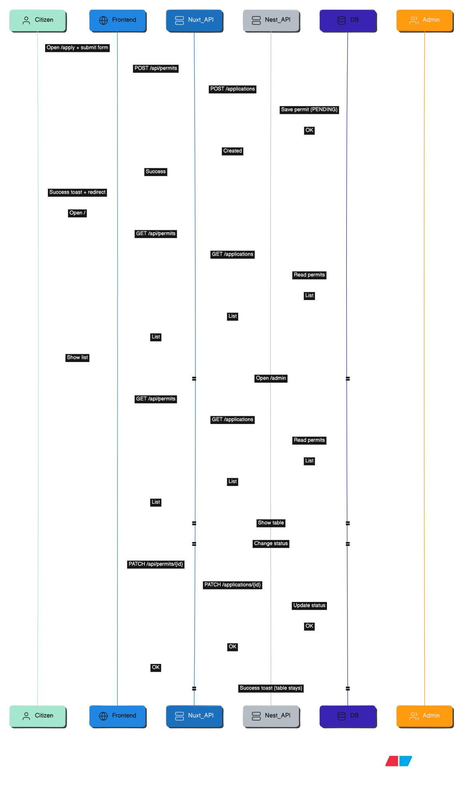

# 🏛️ Permit Request Service Portal

A simple monorepo for a **Permit Request Service Portal**:

-   **Frontend**: Nuxt 4 (RTL, Saudi National Design System)
-   **Backend**: NestJS + Prisma
-   **Database**: PostgreSQL
-   **Orchestration**: Docker Compose

Citizens can submit permit applications, and an admin can view and update their status (Pending, Approved, Rejected). All frontend API calls go through Nuxt Server Routes which proxy to the NestJS backend.

## 🔄 High-Level Flow Diagram



---

## 🐳 Run with Docker Compose

## 📦 Prerequisites

-   **Docker**: v20.x or higher
-   **Docker Compose**: v2.x or higher
-   **Git**: Latest version

### 1. Clone the repository

```bash
git clone <repository-url>
cd Permit-Request-Portal
```

### 2. Start the stack

```bash
docker-compose up
```

This will start:

-   PostgreSQL on `localhost:5433`
-   NestJS backend on `http://localhost:3001`
-   Nuxt frontend on `http://localhost:3000`

### 3. (First time only) Apply database migrations

In a separate terminal:

```bash
cd Permit-Request-Portal
docker-compose exec backend npx prisma migrate deploy
```

### 4. Open the app

-   Frontend: `http://localhost:3000`
-   Backend API (list current permits): `http://localhost:3001/applications`

### 5. Stop everything

In the Docker terminal, press `Ctrl + C`, then:

```bash
docker-compose down
```
